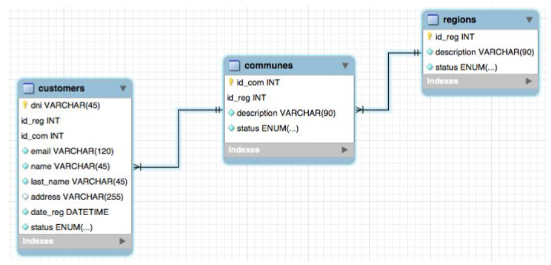

# API con Lumen

Este proyecto permite registrar, consultar y eliminar Customers, de acuerdo al siguiente modelo:



# Instalación y Configuración

## Requerimientos Mínimos

Para ejecutar este proyecto, es necesario tener instalados los requerimientos mínimos del framework Lumen:

* Composer.
* PHP >= 8.0.
* OpenSSL PHP Extension.
* PDO PHP Extension
* Mbstring PHP Extension.

## Pasos de Instalación

### 1. Clonar el Repositorio

```
git clone https://github.com/AnzurezDev/Customer-REST-API.git
```

### 2. Instalar Dependencias

Navega al directorio del proyecto y ejecuta el siguiente comando para instalar las dependencias:

```
composer install
```

### 3. Configurar la Base de Datos

Crea un archivo .env basado en el archivo .env.example y configura tus credenciales de base de datos.

Ejecuta las migraciones para crear las tablas necesarias:

```
php artisan migrate
```

### 4. Iniciar el Servidor

Utiliza el siguiente comando para iniciar el servidor local:

```
php -S localhost:8000 -t public
```

## Configuración Adicional

Si deseas alimentar la base de datos con información de prueba, el proyecto incluye Seeders que puden ser ejecutados con el siguiente comando:

```
php artisan db:seed
```

Si deseas ejecutar un Seeder en específico, lo puedes hacer con el comando:

```
php artisan db:seed --class=SpecificSeeder
```

Donde SpecificSeeder puede ser alguno de los siguientes Seeders:

* **`RegionsTableSeeder`**: Rellenará la tabla `regions`.
* **`CommunesTableSeeder`**: Rellenará la tabla `communes`.
* **`CustomersTableSeeder`**: Rellenará la tabla `customers`.
* **`UsersTableSeeder`**: Rellenará la tabla `users`.

La tabla `users` permite iniciar sesión para poder obtener el token de acceso y utilizar los servicios.

# Servicios API

Esta API proporciona varios servicios para interactuar con la base de datos de **customer**. A continuación se detallan los servicios disponibles:

## 1. Registar Customer

### Endpoint:

```
POST /api/customers
```

### Descripción:

Este servicio permite registrar un nuevo customer en el sistema.

### Parámetros de Solicitud:

* **`dni`** (string, obligatorio): Documento de identidad del cliente.
* **`id_reg`** (integer, obligatorio): ID de la región del cliente.
* **`id_com`** (integer, obligatorio): ID de la comuna del cliente.
* **`email`** (string, obligatorio): Correo electrónico del cliente.
* **`name`** (string, obligatorio): Nombre del cliente.
* **`last_name`** (string, obligatorio): Apellido del cliente.
* **`address`** (string, opcional): Dirección del cliente.
* **`status`** (enum[A, I, trash], obligatorio): Estado del registro (Activo, Inactivo, Eliminado).

### Ejemplo de Solicitud:

```
{
    "dni": "K87P23S8T9",
    "id_reg": 1,
    "id_com": 2,
    "email": "john.doe@example.com",
    "name": "John",
    "last_name": "Doe",
    "address": "123 Oak St, Smalltown, USA",
    "status": "A"
}
```

### Respuesta exitosa:

```
{
    "success": true,
    "data": {
        "dni": "K87P23S8T9",
        "id_reg": 1,
        "id_com": 2,
        "email": "john.doe@example.com",
        "name": "John",
        "last_name": "Doe",
        "address": "123 Oak St, Smalltown, USA",
        "status": "A",
        "date_reg": "2023-09-19 09:30:45"
    }
}
```

### Respuesta de Error:

```
{
    "success": false,
    "data": {
        "message": "Error al registrar el cliente."
    }
}
```

## 2. Consultar Customer por DNI o Correo Electrónico

### Endpoint:

```
GET /api/customers/{search}
```

### Descripción:

Este servicio permite consultar un cliente (name, last_name, address, description_region y description_commune) por su número de documento de identidad (DNI) o su correo electrónico.

### Parámetros de Ruta:

* **`search`** (string, obligatorio): DNI o correo electrónico del cliente a buscar.

### Ejemplo de solicitud:

```
GET /api/customers/K87P23S8T9
GET /api/customers/john.doe@example.com
```

### Respuesta exitosa:

```
{
    "success": true,
    "data": [
       {
            "name": "John",
            "last_name": "Doe",
            "address": "123 Oak St, Smalltown, USA",
            "description_commune": "Commune 3 in Rural Region",
            "description_region": "Rural Region"
        }
    ]
}
```

### Respuesta de error:

```
{
    "success": false,
    "data": {
        "message": "Cliente no encontrado."
    }
}
```

## 3. Eliminar lógicamente el Customer

### Endpoint:

```
DELETE /api/customers/{dni}
```

### Descripción:

Este servicio permite eliminar un cliente lógicamente (Cambiando el status a 'trash') por su número de documento de identidad (DNI).

### Parámetros de Ruta:

* **`dni`** (string, obligatorio): DNI del cliente a eliminar.

### Ejemplo de solicitud:

```
DELETE /api/customers/K87P23S8T9
```

### Respuesta exitosa:

```
{
    "success": true,
    "data": {
        "message": "Registro eliminado."
    }
}
```

### Respuesta de error:

```
{
    "success": false,
    "data": {
        "message": "El registro no fue eliminado."
    }
}
```

## 4. Consultar todos los Customer activos

### Endpoint:

```
GET /api/customers
```

### Descripción:

Este servicio permite consultar todos los clientes activos (En status 'A').

### Ejemplo de solicitud:

```
GET /api/customers
```

### Respuesta exitosa:

```
{
    "success": true,
    "data": [
        {
            "name": "John",
            "last_name": "Doe",
            "address": "123 Oak St, Smalltown, USA",
            "description_commune": "Commune 3 in Rural Region",
            "description_region": "Rural Region"
        },
        {
            "name": "Juan",
            "last_name": "Perez",
            "address": "123 Oak St, Anytown, USA",
            "description_commune": "Commune 1 in North Region",
            "description_region": "North Region"
        },
        {
            "name": "Laura",
            "last_name": "Gomez",
            "address": "456 Maple Ave, Somecity, USA",
            "description_commune": "Commune 2 in South Region",
            "description_region": "South Region"
        },
    ]
}
```

# Uso

Antes de utilizar los servicios de este proyecto, es necesario obtener un token de autenticación. Sigue los pasos a continuación para generar un token:

## 1. Registrar usuario

### Endpoint:

```
POST /users
```

### Descripción:

Este servicio permite registrar un nuevo usuario para acceder a los servicios de la API.

### Parámetros de Solicitud:

* **`name`** (string, obligatorio): Nombre del usuario.
* **`password`** (string, obligatorio): Contraseña del usuario.
* **`email`** (string, obligatorio): Correo electrónico del usuario.
* **`status`** (enum[A, I, trash], obligatorio): Estado del registro (Activo, Inactivo, Eliminado).

### Ejemplo de Solicitud:

```
{
    "name": "Usuario",
    "password": "user",
    "email": "user@email.com"
}
```

### Respuesta exitosa:

```
{
    "success": true,
    "data": {
        "name": "Usuario",
        "email": "user@email.com",
        "updated_at": "2023-09-19 09:30:45",
        "created_at": "2023-09-19 09:30:45",
        "id": 4
    }
}
```

### Respuesta de Error:

```
{
    "success": false,
    "data": {
        "message": "Error al registrar el usuario."
    }
}
```

## 2. Iniciar sesión

### Endpoint:

```
POST /login
```

### Descripción:

Este servicio permite iniciar sesión con las credenciales de un usuario para obtener el token de acceso a los servicios de la API.

### Parámetros de Solicitud:

* **`email`** (string, obligatorio): Correo electrónico del usuario.
* **`password`** (string, obligatorio): Contraseña del usuario.

### Ejemplo de Solicitud:

```
{
    "email": "admin@email.com",
    "password": "admin"
}
```

### Respuesta exitosa:

```
{
    "success": true,
    "data": {
        "token": "b78a89ea049fa815dc89734969b61c24a5b93926",
        "message": "Acceso correcto"
    }
}
```

### Respuesta de Error:

```
{
    "success": false,
    "data": {
        "message": "Acceso denegado"
    }
}
```

## 3. Usar el Token

Incluye el token en el cuerpo de todas las solicitudes a los servicios protegidos. El token debe ir como  `token` de la siguiente manera:

```
{
    "token": "b78a89ea049fa815dc89734969b61c24a5b93926"
}
```